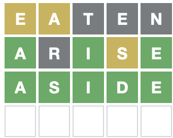
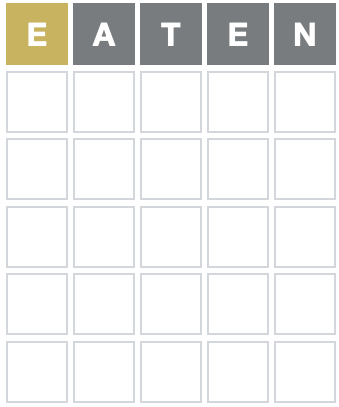
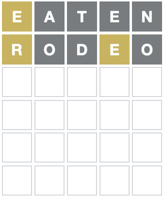
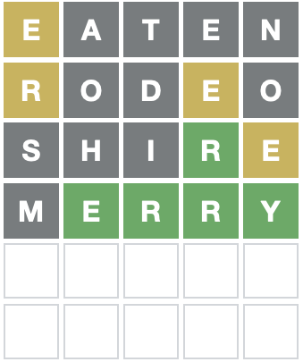
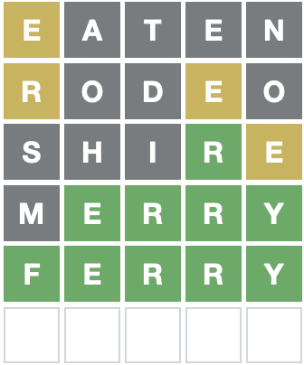

<!-- README.md is generated from README.Rmd. Please edit that file -->

```{r, include = FALSE}
knitr::opts_chunk$set(
  collapse = TRUE,
  comment = "#>",
  fig.path = "man/figures/README-",
  out.width = "100%"
)

library(wordle)
```

# wordle

<!-- badges: start -->

[](https://github.com/coolbutuseless/wordle/actions)
<!-- badges: end -->


The `{wordle}` package contains code to assist in finding good candidate
words for Wordle.

"Wordle" itself is a guess-a-word puzzle [playable online](https://www.powerlanguage.co.uk/wordle/).

The game plays like the old 'mastermind' board game, but with letters instead of
coloured pins.  The gameplay is as follows:

1. Enter a word as a guess for the hidden target word.
2. Any letters which are within the hidden target word are coloured in yellow.
3. Any letters which match exactly the letter in the hidden target word are
   coloured green
4. Figure out a new candidate word as a guess for the hidden target word,
   and go back to Step 1.
   
In the following game of Wordle, the first guess was `eaten`, the second was
`arise`, and then the third guess really only has one good option given the
constraints revealed so far: `aside`.  This was the hidden target word, 
which means the puzzle is solved!


   
   


The process of finding good candidate words given letters which have been seen
so far is a good match for regular expressions.  This package aims to help
you find these good candidate words.

## What's in the box

* `wordle_dict` an 'official' list of words scraped from the Wordle website
* `Wordle` R6 Class is the primary way of finding candidate words. It has the 
  following methods:
    * `$new()` to start a new object to help with a new puzzle. 
    * `$get_suggestions()` to get a list of candidate words given the words
      and responses that have been seen so far
    * `$update()` to notify the object of what the latest `word` was, and the 
      colour responses received back from the game for each letter.
* `filter_words()` is a stateless function for filtering a list of words 
  by various constraints on letter position.
    * The `Wordle` class is a stateful wrapper around `filter_words()`

## Installation

You can install from [GitHub](https://github.com/coolbutuseless/wordle) with:

``` r
# install.package('remotes')
remotes::install_github('coolbutuseless/wordle')
```


# Solving a puzzle with `Wordle`


```{r}
puzzle <- Wordle$new(nchar = 5)
puzzle$get_suggestions()
```

## Guess `eaten`

There are a lot of uncommon words in the word list, and the online puzzle doesn't
accept some of them, so you'll need to pick out a likely word - in this case
I picked: `eaten`





Update puzzle state with the word played and the response:

```{r}
puzzle$update("eaten", c('yellow', 'grey', 'grey', 'grey', 'grey'))
puzzle$get_suggestions()
```


## Guess `rodeo`




Update puzzle state with the word played and the response:

```{r}
puzzle$update("rodeo", c('yellow', 'grey', 'grey', 'yellow', 'grey'))
puzzle$get_suggestions()
```

## Guess `shire`


Update puzzle state with the word played and the response:

```{r}
puzzle$update("shire", c('grey', 'grey', 'grey', 'green', 'yellow'))
puzzle$get_suggestions()
```

## Guess `merry`




Update puzzle state with the word played and the response:

```{r}
puzzle$update("merry", c('grey', 'green', 'green', 'green', 'green'))
puzzle$get_suggestions()
```

## Guess `ferry`



**Success!**


# Expert Users: `filter_words()`

The `Wordle` R6 class is just a stateful wrapper around a core function 
called `filter_words()`.

In general you wouldn't need to call this function for solving a Wordle puzzle
but it might come in handy for other word puzzles.

In this example, I'm searching for a word:

* with 9 letters
* starting with `p`
* containing `v` and `z` somewhere, but not as the first letter
* containing only one `z`
* without an `a` or an `o` in it

```{r}
words <- readLines("/usr/share/dict/words")

filter_words(
  words            = words,
  exact            = "p........",
  wrong_spot       = c("vz", "", "", "", "", "", "", "", ""),
  min_count        = c(v = 1),
  known_count      = c(z = 1, a = 0, o = 0)
)
```


## Acknowledgements

* R Core for developing and maintaining the language.
* CRAN maintainers, for patiently shepherding packages onto CRAN and maintaining
  the repository
