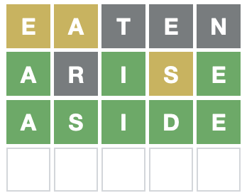

<!-- README.md is generated from README.Rmd. Please edit that file -->

# wordle

<!-- badges: start -->


[](https://github.com/coolbutuseless/wordle/actions)
<!-- badges: end -->

The `{wordle}` package contains code to assist in finding good candidate
words for Wordle.

“Wordle” itself is a guess-a-word puzzle [playable
online](https://www.powerlanguage.co.uk/wordle/).

The game plays like the old ‘mastermind’ board game, but with letters
instead of coloured pins. The gameplay is as follows:

1.  Enter a word as a guess for the hidden target word.
2.  Any letters which are within the hidden target word are coloured in
    yellow.
3.  Any letters which match exactly the letter in the hidden target word
    are coloured green
4.  Figure out a new candidate word as a guess for the hidden target
    word, and go back to Step 1.

In the following game of Wordle, the first guess was `eaten`, the second
was `arise`, and then the third guess really only has one good option
given the constraints revealed so far: `aside`. This was the hidden
target word, which means the puzzle is solved!



The process of finding good candidate words given letters which have
been seen so far is a good match for regular expressions. This package
aims to help you find these good candidate words.

## What’s in the box

-   `Wordle` R6 Class is the primary way of finding candidate words. It
    has the following methods:
    -   `$new()` to start a new object to help with a new puzzle. Use
        the `word_file` argument to set the location of a list of words
        to start with. This defaults to `/usr/share/dict/words` (which
        should work on macOS and many unix-ish systems).
    -   `$get_suggestions()` to get a list of candidate words given the
        words and responses that have been seen so far
    -   `$update()` to notify the object of what the latest `word` was,
        and the colour responses received back from the game for each
        letter.
-   `filter_words()` is a stateless function for filtering a list of
    words by various constraints on letter position.
    -   The `Wordle` class is a stateful wrapper around `filter_words()`

## Installation

You can install from [GitHub](https://github.com/coolbutuseless/wordle)
with:

``` r
# install.package('remotes')
remotes::install_github('coolbutuseless/wordle')
```

# Solving a puzzle with `Wordle`


``` r
puzzle <- Wordle$new(nchar = 5)
puzzle$get_suggestions()
#>  [1] "otate" "tatta" "tenet" "eaten" "enate" "tatie" "teest" "teste" "setae"
#> [10] "tease" "teeth" "theet" "state" "taste" "testa" "arete" "atone" "eater"
#> [19] "neese" "oaten"
```

## Guess `eaten`

There are a lot of uncommon words in the word list, and the online
puzzle doesn’t accept some of them, so you’ll need to pick out a likely
word - in this case I picked: `eaten`


Update puzzle state with the word played and the response:

``` r
puzzle$update("eaten", c('yellow', 'grey', 'grey', 'grey', 'grey'))
puzzle$get_suggestions()
#>  [1] "hoose" "hoise" "issei" "osier" "serio" "diose" "idose" "loose" "oside"
#> [10] "ohelo" "rodeo" "shies" "helio" "horse" "roleo" "shoer" "shore" "cooer"
#> [19] "diode" "hirse"
```

## Guess `rodeo`


Update puzzle state with the word played and the response:

``` r
puzzle$update("rodeo", c('yellow', 'grey', 'grey', 'yellow', 'grey'))
puzzle$get_suggestions()
#>  [1] "hirse" "shire" "cheir" "cress" "swire" "crile" "serif" "shure" "cerci"
#> [10] "ceric" "girse" "curie" "ferri" "freir" "meril" "ureic" "crime" "fresh"
#> [19] "spire" "birse"
```

## Guess `shire`


Update puzzle state with the word played and the response:

``` r
puzzle$update("shire", c('grey', 'grey', 'grey', 'green', 'yellow'))
puzzle$get_suggestions()
#>  [1] "merry" "ferry" "clerk" "perry" "berry" "lyery" "kerry" "querl" "becry"
#> [10] "jerry" "query" "Jerry" "Jewry" "Kerry" "Perry"
```

## Guess `merry`


Update puzzle state with the word played and the response:

``` r
puzzle$update("merry", c('grey', 'green', 'green', 'green', 'green'))
puzzle$get_suggestions()
#> [1] "ferry" "perry" "berry" "kerry" "jerry" "Jerry" "Kerry" "Perry"
```

## Guess `ferry`


**Success!**

# Expert Users: `filter_words()`

The `Wordle` R6 class is just a stateful wrapper around a core function
called `filter_words()`.

In general you wouldn’t need to call this function for solving a Wordle
puzzle but it might come in handy for other word puzzles.

In this example, I’m searching for a word:

-   with 9 letters
-   starting with `p`
-   containing `v` and `z` somewhere, but not as the first letter
-   containing only one `z`
-   without an `a` or an `o` in it

``` r
words <- readLines("/usr/share/dict/words")

filter_words(
  words            = words,
  exact            = "p........",
  excluded_letters = "ao",
  wrong_spot       = c("vz", "", "", "", "", "", "", "", ""),
  known_count      = c(z = 1)
)
#> [1] "pulverize"
```

## Acknowledgements

-   R Core for developing and maintaining the language.
-   CRAN maintainers, for patiently shepherding packages onto CRAN and
    maintaining the repository
