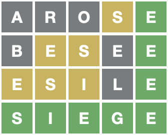

<!-- README.md is generated from README.Rmd. Please edit that file -->

# wordle

<!-- badges: start -->


[](https://github.com/coolbutuseless/wordle/actions)
<!-- badges: end -->

The `{wordle}` package contains code to assist in finding good candidate
words for Wordle.

“Wordle” itself is a guess-a-word puzzle [playable
online](https://www.powerlanguage.co.uk/wordle/).

The game plays like the old ‘mastermind’ board game, but with letters
instead of coloured pins. The gameplay is as follows:

1.  Enter a word as a guess for the hidden target word.
2.  Any letters which are within the hidden target word are coloured in
    yellow.
3.  Any letters which match exactly the letter in the hidden target word
    are coloured green
4.  Figure out a new candidate word as a guess for the hidden target
    word, and go back to Step 1.

In the following game of Wordle, the first guess was `eaten`, the second
was `arise`, and then the third guess really only has one good option
given the constraints revealed so far: `aside`. This was the hidden
target word, which means the puzzle is solved!


The process of finding good candidate words given letters which have
been seen so far is a good match for regular expressions. This package
aims to help you find these good candidate words.

## What’s in the box

-   `play_wordle()` Simple way to play a game of wordle in the R console
-   `wordle_dict` an ‘official’ list of words scraped from the Wordle
    website
-   `WordleHelper` R6 Class is the primary way of finding candidate
    words. It has the following methods:
    -   `$new()` to start a new object to help with a new puzzle.
    -   `$words` to get a list of all the remaining possible valid words
        given the words and responses that have been seen so far
    -   `$update()` to notify the object of what the latest `word` was,
        and the colour responses received back from the game for each
        letter.
    -   The `Wordle` class is a stateful wrapper around `filter_words()`

Advanced:

-   `filter_words()` is a stateless function for filtering a list of
    words by various constraints on letter position.
-   `WordleGame` R6 class represnting a wordle game engine
    -   `$new()` to create a new game and internally choose a target
        word for this game
    -   `$try(word)` to try a word and see what the respnse is in
        relation to the hidden target word
    -   `$share()` create a block of unicode representing the evolution
        of the solution process.

## Installation

You can install from [GitHub](https://github.com/coolbutuseless/wordle)
with:

``` r
# install.package('remotes')
remotes::install_github('coolbutuseless/wordle')
```

# Play a game

``` r
wordle::play_wordle()
```


# Solving a puzzle with `wordle::WordleHelper`

In this example, after picking my favourite starting word, I will just
pick the first word in the alphabetical list of remaining possible
words.


``` r
helper <- WordleHelper$new(nchar = 5)
length(helper$words)
#> [1] 12972
head(helper$words)
#> [1] "aahed" "aalii" "aargh" "aarti" "abaca" "abaci"
```

## Initial word choice: `arose`

There are many opinions on a good starting word - I like: `arose`


Update puzzle state with the word played and the response:

``` r
helper$update("arose", c('grey', 'grey', 'grey', 'yellow', 'green'))
helper$words
#>  [1] "besee" "disme" "ensue" "esile" "fusee" "geste" "gusle" "issue" "istle"
#> [10] "lisle" "mesne" "piste" "pusle" "scene" "scute" "sedge" "segue" "seine"
#> [19] "seize" "selle" "semee" "semie" "sente" "shine" "shite" "shive" "shule"
#> [28] "shute" "sidhe" "sidle" "siege" "sieve" "since" "singe" "sithe" "sixte"
#> [37] "skene" "skite" "skive" "skyte" "slice" "slide" "slime" "slipe" "slive"
#> [46] "slype" "smeke" "smile" "smite" "snide" "snipe" "spice" "spide" "spike"
#> [55] "spile" "spine" "spite" "spule" "spume" "stede" "stele" "steme" "stile"
#> [64] "stime" "stipe" "stive" "stude" "stupe" "style" "styme" "styte" "suede"
#> [73] "suete" "suite" "sujee" "swede" "swile" "swine" "swipe" "swive" "sybbe"
#> [82] "sycee" "sythe" "teste" "unsee" "upsee" "usque" "visie" "visne"
```

## Choose the first word: `besee`


Update puzzle state with the word played and the response:

``` r
helper$update("besee", c('grey', 'yellow', 'yellow', 'grey', 'green'))
helper$words
#>  [1] "esile" "scene" "siege" "sieve" "skene" "smeke" "stede" "stele" "steme"
#> [10] "suede" "suete" "sujee" "swede" "sycee"
```

## Choose the first word: `esile`


Update puzzle state with the word played and the response:

``` r
helper$update("esile", c('yellow', 'yellow', 'yellow', 'grey', 'green'))
helper$words
#> [1] "siege" "sieve"
```

## Choose the first word: `siege`



**Success!**

# Optimizing word selection

In the above worked example no effort was made to optimize the word
choice - instead the first word in the alphabetical list of remaining
words was chosen.

There may be opportunities to pick the “best” word that helps to solve
the puzzle faster, but no such code is included in this package - yet!

For example, it may be possible to pick the word that when played
results in the most *other* words in the remaining list of words to be
eliminated.

# Expert Function: `filter_words()`

The `Wordle` R6 class is just a stateful wrapper around a core function
called `filter_words()`.

In general you wouldn’t need to call this function for solving a Wordle
puzzle but it might come in handy for other word puzzles.

In this example, I’m searching for a word:

-   with 9 letters
-   starting with `p`
-   containing `v` and `z` somewhere, but not as the first letter
-   containing only one `z`
-   without an `a` or an `o` in it

``` r
words <- readLines("/usr/share/dict/words")

filter_words(
  words            = words,
  exact            = "p........",
  wrong_spot       = c("vz", "", "", "", "", "", "", "", ""),
  min_count        = c(v = 1),
  known_count      = c(z = 1, a = 0, o = 0)
)
```

    #> [1] "pulverize"

## Acknowledgements

-   R Core for developing and maintaining the language.
-   CRAN maintainers, for patiently shepherding packages onto CRAN and
    maintaining the repository
